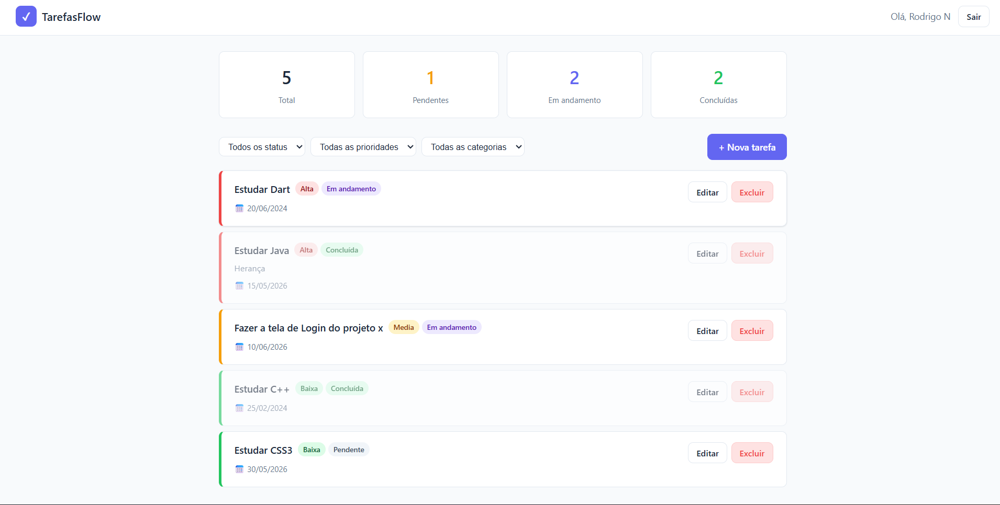

# TarefasFlow — Gerenciador de Tarefas

Sistema web de gerenciamento de tarefas com autenticação, categorias e filtros, desenvolvido com PHP puro, MySQL e JavaScript vanilla.

## Funcionalidades

- Autenticação segura com `password_hash` e sessões PHP
- Cadastro e login de usuários
- CRUD completo de tarefas
- Prioridades: Alta, Média, Baixa
- Status: Pendente, Em andamento, Concluída
- Categorias personalizadas com cor
- Filtros por status, prioridade e categoria
- Dashboard com estatísticas em tempo real
- Interface responsiva

## Tecnologias

| Camada     | Tecnologia                     |
|------------|-------------------------------|
| Backend    | PHP 8+                        |
| Banco      | MySQL 8 / MariaDB             |
| Frontend   | HTML5, CSS3, JavaScript       |
| Ambiente   | XAMPP / WAMP / Docker         |

## Como rodar localmente

### Pré-requisitos

- PHP 8.0+
- MySQL 8.0+
- XAMPP, WAMP ou servidor equivalente

## Estrutura do projeto

## Estrutura do projeto

```
gerenciador-tarefas/
├── api/
│   ├── index.php           # Endpoints REST (GET, POST, PUT, DELETE)
│   └── login.php           # Autenticação e geração de token
├── config/
│   ├── database.php        # Conexão com banco
│   ├── auth.php            # Funções de sessão e autenticação
│   └── schema.sql          # Estrutura do banco
├── pages/
│   ├── tarefa_form.php     # Criar e editar tarefas
│   ├── tarefa_delete.php   # Excluir tarefa
│   └── atualizar_status.php # Atualiza status via Kanban
├── assets/
│   ├── css/style.css       # Estilos + modo escuro
│   └── js/main.js          # JavaScript + Kanban + tema
├── screenshots/            # Capturas de tela
├── index.php               # Dashboard principal
├── login.php               # Tela de login
├── register.php            # Cadastro de usuário
└── logout.php              # Encerrar sessão
```

## Capturas de tela





## Próximas melhorias

- [✅]Modo escuro / claro com persistência
- [✅] Drag-and-drop estilo Kanban
- [✅] Notificações de prazo
- [✅] API REST para consumo mobile

## Autor

**Rodrigo Nascimento da Silva**
- GitHub: https://github.com/RodrigoNs09/
- LinkedIn:https://linkedin.com/in/rodrigo-nascimento-da-silva
